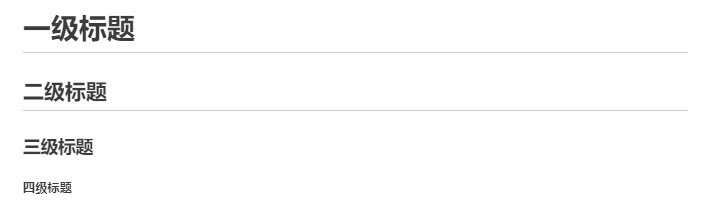
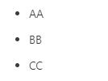
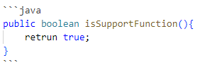
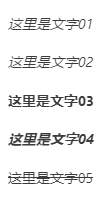
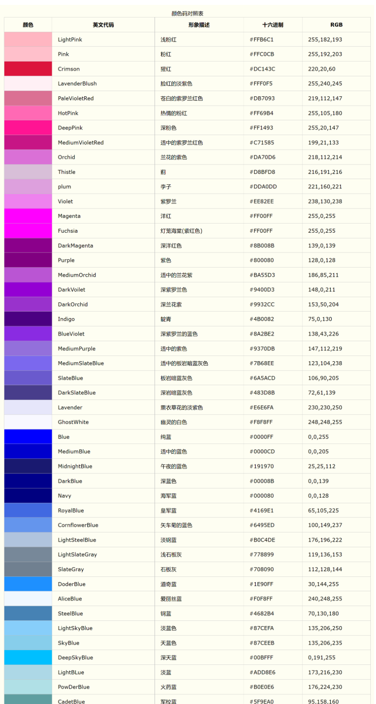

# Markdown Common Syntax
markdown常用语法

---

## 分级标题显示

- 语法：

```java
# 一级标题
## 二级标题
### 三级标题
##### 四级标题
......
```
- 显示效果：



---

## 分类列表显示

- 语法：

```java
- AA
- BB
- CC
```

- 显示效果：




---

## 有序分类列表显示

- 语法：

使用数字和一个英文句点表示有序列表。

注意：英文句点后面一定要有一个空格，起到缩进的作用。

```java
1. 我是有序列表
2. 我是有序列表
3. 我是有序列表
```


- 显示效果：


---

## 代码块

- 语法：

在代码块的每一行前面添加至少4个空格或一个制表符（Tab）。

1.1 java语言，每一行前加一个Tab键

    java源码显示效果
    public boolean isSupportFunction(){
        retrun true;
    }


1.2 代码块可以用三个反引号(```)包围起来,指定java语言类型




- 显示效果：

2.1 java 每一行前加一个Tab键

    java源码显示效果
    public boolean isSupportFunction(){
        retrun true;
    }


2.2 代码块可以用三个反引号(```)包围起来,指定java语言类型

```java
public boolean isSupportFunction(){
    retrun true;
}
```


---

## 分隔线

- 语法：

在单独一行上使用三个或多个星号 (***)、破折号 (---) 或下划线 (___) ，并且不能包含其他内容。

```java
---
***
___
```

- 显示效果：


---

## 设计粗体斜体和删除线

- 语法：

```java
*这里是文字01*

_这里是文字02_

**这里是文字03**

***这里是文字04***

~~这里是文字05~~
```

- 显示效果：



---

## 文本位置

可以使用div标签，p标签，或者h标签

- 语法：

```java
<center>文本位置：居中</center>

<p align="left">文本位置：居左，使用p标签</p>
<p align="center">文本位置：居中，使用p标签</p>
<p align="right">文本位置：居右，使用p标签</p>

<div align=right>文本位置：居右，使用div标签</div>
<h5 style="text-align:right">文本位置：居右，使用h标签</h5>
```

- 显示效果：

<center>文本位置：居中</center>

<p align="left">文本位置：居左，使用p标签</p>
<p align="center">文本位置：居中，使用p标签</p>
<p align="right">文本位置：居右，使用p标签</p>

<div align=right>文本位置：居右，使用div标签</div>


---

## 图片

- 语法：

```java


[](https://github.com/hfreeman2008)


<div align="center">  </div>

<div align="center">  </div>
```

- 显示效果：

显示指定路径的图片：


[](https://github.com/hfreeman2008)


<div align="center">  </div>

<div align="center">  </div>

---

## 链接语法

- 语法：

```java
<https://github.com/hfreeman2008>

[文本替换链接](https://www.baidu.com/)
[文本替换链接到baidu](https://www.baidu.com/)
[百度一下，你就知道](baidu.com "鼠标停在上面会显示的提示内容")
<a href="https://www.baidu.com/" title="鼠标停在上面会显示的提示内容">baidu显示的title文体</a>
```

- 显示效果：

<https://github.com/hfreeman2008>

[文本替换链接](https://www.baidu.com/)

[文本替换链接到baidu](https://www.baidu.com/)

[百度一下，你就知道](baidu.com "鼠标停在上面会显示的提示内容")

<a href="https://www.baidu.com/" title="鼠标停在上面会显示的提示内容">baidu显示的title文体</a>

---

## 锚点

- 语法：

锚点实际上就是页内连接

```java
## 这是我的标题{#index}   //在某个标题后面设置锚点

跳转到[目录](#index)		//回到锚点

```


- 显示效果：

跳转到[文章目录的开头](#markdown-common-syntax)


---

## 表格

- 语法：

```java
姓名|学号|分数
-|-|-
孙悟空|2021|95
猪八戒|20211|96
```


- 显示效果：

姓名|学号|分数
-|-|-
孙悟空|2021|95
猪八戒|20211|96


---

## 背景色
在markdown语法里，本身也是没有背景色这样一个选项的。所以，就需要用内置HTML的形式。
借助 table, tr, td 等表格标签的 bgcolor 属性来实现背景色的功能。

- 语法：

```java
<table><tr><td bgcolor=orange>背景色是：orange</td></tr></table>
<table><tr><td bgcolor=green>背景色是：green</td></tr></table>
```

- 显示效果：


---

## 设计字体字号和颜色


- 语法：

```java
<font face='黑体' color=#ff0000 size=10>我是正文,字体size为10</font>
<span style="color:red;">红色字体</span>
```

- 显示效果：


<span style="color:red;">红色字体</span>


备注：

这里的【黑体】，也可以改成【宋体】、【楷体】、【微软雅黑】等等。这里的size，是规定文本尺寸的大小。一般是从1-7，浏览器默认为3。至于这里的color，建议可以用十六进制来表示，也可以用rgb来表示。如下表：仅截取了部分。如果没有你想要的颜色，可以查看RGB颜色值与十六进制颜色码对照表：

[RGB颜色值与十六进制颜色码对照表](https://www.cnblogs.com/remember-forget/p/8134849.html)

https://www.cnblogs.com/remember-forget/p/8134849.html



---


# 参考资料

1.Markdown简介

https://blog.csdn.net/xdnxl/article/details/129518943


---


[<font face='黑体' color=#ff0000 size=40 >跳转到文章开始</font>](#markdown-common-syntax)


