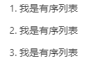
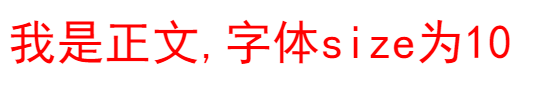

# Markdown Common Syntax
markdown常用语法

---

## 分级标题显示

- 语法：

```java
# 一级标题
## 二级标题
### 三级标题
##### 四级标题
......
```
- 显示效果：


---

## 分类列表显示
- 语法：

```java
- AA
- BB
- CC
```

- 显示效果：


---

## 有序分类列表显示

- 语法：

使用数字和一个英文句点表示有序列表。

注意：英文句点后面一定要有一个空格，起到缩进的作用。

```java
1. 我是有序列表
2. 我是有序列表
3. 我是有序列表
```


- 显示效果：




---

## 代码

- 语法：

```java
注意，删除前面的//
//```java
//java源码显示效果
//public boolean isSupportFunction(){
//    retrun true;
//}
//```
```

- 显示效果：

```java
//java源码显示效果
//public boolean isSupportFunction(){
//    retrun true;
//}
```

---

## 分隔符

```java
---

```

- 显示效果：


---

## 显示图片

- 语法：

```java


```

- 显示效果：

显示指定路径的图片：


---


## 设计粗体斜体和删除线

- 语法：

```java
*这里是文字01*

_这里是文字02_

**这里是文字03**

***这里是文字04***

~~这里是文字05~~
```

- 显示效果：


---

## 链接语法

- 语法：
```java
[文本替换链接](链接)
[文本替换链接到baidu](https://www.baidu.com/)
```

- 显示效果：

[文本替换链接到baidu](https://www.baidu.com/)

---

## 锚点

- 语法：

锚点实际上就是页内连接

```java
## 这是我的标题{#index}   //在某个标题后面设置锚点

跳转到[目录](#index)		//回到锚点

```


- 显示效果：

跳转到[文章目录的开头](#markdown-common-syntax)


---

## 表格

- 语法：

```java
姓名|学号|分数
-|-|-
孙悟空|2021|95
猪八戒|20211|96
```


- 显示效果：

姓名|学号|分数
-|-|-
孙悟空|2021|95
猪八戒|20211|96


---

## 背景色
在markdown语法里，本身也是没有背景色这样一个选项的。所以，就需要用内置HTML的形式。
借助 table, tr, td 等表格标签的 bgcolor 属性来实现背景色的功能。

- 语法：

```java
<table><tr><td bgcolor=orange>背景色是：orange</td></tr></table>
<table><tr><td bgcolor=green>背景色是：green</td></tr></table>
```

- 显示效果：


---

## 设计字体字号和颜色


- 语法：

```java
<font face='黑体' color=#ff0000 size=10>我是正文,字体size为10</font>
```

- 显示效果：




备注：

这里的【黑体】，也可以改成【宋体】、【楷体】、【微软雅黑】等等。这里的size，是规定文本尺寸的大小。一般是从1-7，浏览器默认为3。至于这里的color，建议可以用十六进制来表示，也可以用rgb来表示。如下表：仅截取了部分。如果没有你想要的颜色，可以查看RGB颜色值与十六进制颜色码对照表：

[RGB颜色值与十六进制颜色码对照表](https://www.cnblogs.com/remember-forget/p/8134849.html)

https://www.cnblogs.com/remember-forget/p/8134849.html


---


# 参考资料

1.Markdown简介

https://blog.csdn.net/xdnxl/article/details/129518943